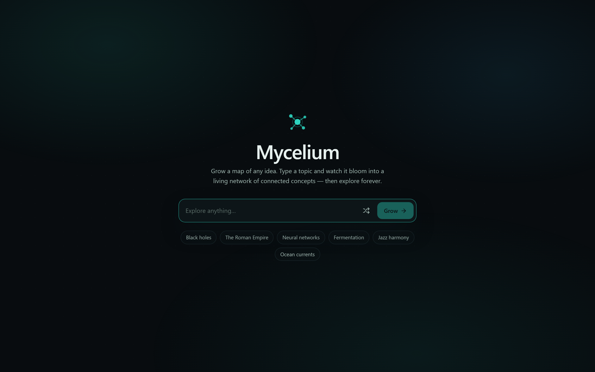
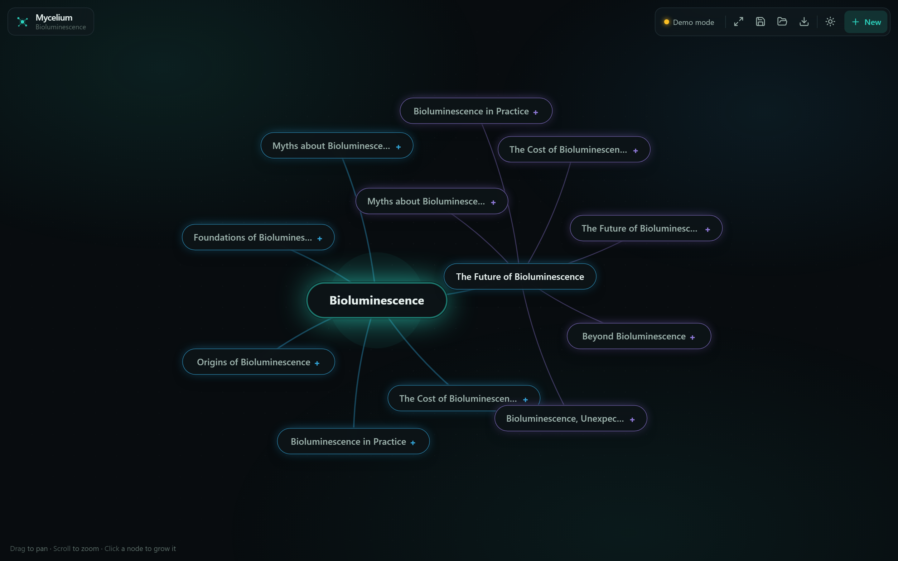
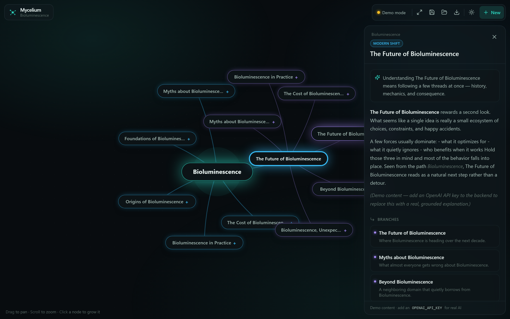
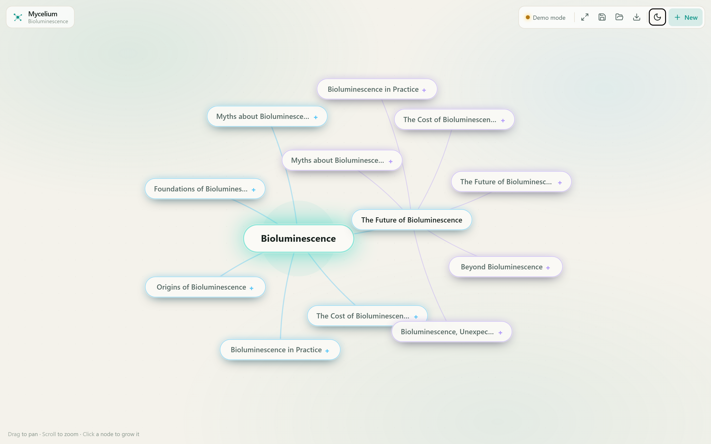

# 🍄 Mycelium — *grow a map of any idea*

Mycelium is an AI knowledge explorer. Type any topic and it **blooms into a living,
force-directed map** of connected concepts. Click any node and an AI **streams a
deep-dive** while new related ideas sprout around it. Explore any subject
infinitely, save your maps, and export them as images.

> Built as a personal passion project to explore what "thinking tools" feel like
> when the graph is the interface — not a chat box.

<p align="center"><em>Python · FastAPI · OpenAI · TypeScript · Next.js · React · a hand-written force-directed physics engine</em></p>

## Screenshots

<table>
<tr>
<td width="50%"><br/><sub>Start from any topic</sub></td>
<td width="50%"><br/><sub>It blooms into a living, force-directed map</sub></td>
</tr>
<tr>
<td><br/><sub>Click any node for a streaming AI deep-dive</sub></td>
<td><br/><sub>Considered light &amp; dark themes</sub></td>
</tr>
</table>

---

## Why it exists

Most AI tools are a chat window. But ideas aren't linear — they branch. Mycelium
treats **exploration as the primary interaction**: the map *is* the conversation.
It's a study in doing hard UX well (custom physics, streaming, 60fps rendering)
on top of a clean, typed full-stack.

## Highlights

- **Living graph canvas** — a from-scratch force-directed layout (no graph
  library) with spring links, many-body repulsion, soft collision, pan/zoom, drag,
  and eased fit-to-view. Physics runs off the React render path for a smooth 60fps.
- **Streaming AI deep-dives** — explanations stream token-by-token over
  Server-Sent Events (FastAPI `StreamingResponse` → `fetch` reader).
- **Structured expansion** — each node expands into related concepts via an OpenAI
  JSON-mode call, validated with Pydantic on the way out.
- **Works with zero setup** — no API key? It runs on a deterministic **mock
  engine** so the whole product is demoable offline. Add a key and it's real.
- **Persistence** — save/load/delete maps via a small SQLite-backed API
  (Postgres-ready access layer).
- **Considered UX** — light/dark themes, keyboard shortcuts, PNG export, toasts,
  empty-state onboarding, and motion that explains state instead of decorating it.

## Architecture

```
┌────────────────────────── frontend (TypeScript) ──────────────────────────┐
│  Next.js 14 (App Router) · React 18 · Tailwind · Zustand · Framer Motion   │
│                                                                            │
│  GraphCanvas  ── custom physics loop (lib/physics.ts), SVG + foreignObject │
│  DeepDivePanel ── consumes the SSE stream, renders streamed Markdown       │
│  store.ts     ── single source of truth; keeps positions OUT of React      │
└───────────────────────────────┬────────────────────────────────────────────┘
                                 │  /api/*  (Next rewrites → :8000)
┌───────────────────────────────┴────────────────────────────────────────────┐
│                          backend (Python)                                   │
│  FastAPI                                                                     │
│   /api/expand    concept → {summary, branches[]}   (OpenAI JSON / mock)     │
│   /api/deepdive  concept → streamed text            (SSE, OpenAI / mock)    │
│   /api/maps      CRUD saved maps                    (SQLite)                │
│                                                                             │
│  llm.py   ── provider abstraction; degrades to mock_data.py on any failure  │
└─────────────────────────────────────────────────────────────────────────────┘
```

**Key design decision:** node positions (`x/y/vx/vy`) are mutated in place by the
physics loop and are deliberately *not* part of React state. Only *semantic*
changes (adding nodes, streamed text, selection) trigger re-renders; the 60fps
motion is driven by direct ref writes. See `lib/store.ts` and
`components/GraphCanvas.tsx`.

## Quick start

**Prerequisites:** Python 3.10+ and Node 18+.

### 1. Backend

```bash
cd backend
python -m venv .venv
# Windows:
.venv\Scripts\activate
# macOS/Linux:
# source .venv/bin/activate
pip install -r requirements.txt

# optional — enable real AI:
cp .env.example .env        # then paste your OPENAI_API_KEY

uvicorn app.main:app --reload --port 8000
```

### 2. Frontend

```bash
cd frontend
npm install
npm run dev
```

Open **http://localhost:3000**.

> No OpenAI key? Everything still works — you'll see a **Demo mode** badge and the
> mock engine serves realistic content for any topic.

### One-command start (Windows)

From the repo root:

```powershell
./run-dev.ps1
```

This boots the backend and frontend together in one window.

## Enabling real AI

Add to `backend/.env`:

```
OPENAI_API_KEY=sk-...
OPENAI_MODEL=gpt-4o-mini      # any chat model; JSON mode is used for expansion
# OPENAI_BASE_URL=            # optional: Azure / OpenRouter / local, etc.
```

Restart the backend. The status pill turns from **Demo mode** to the model name.

## Tech notes worth a look

| Concern | Where | Why it's interesting |
|---|---|---|
| Force-directed layout | `frontend/lib/physics.ts` | Hand-rolled O(n²) sim: repulsion, springs, collision, cooling |
| 60fps without re-render storms | `frontend/components/GraphCanvas.tsx` | rAF writes transforms via refs; React owns structure only |
| Streaming | `backend/app/main.py`, `frontend/lib/api.ts` | SSE over `fetch` reader (POST body, so not `EventSource`) |
| Graceful degradation | `backend/app/llm.py` | One try/except boundary flips real ↔ mock transparently |
| Typed contract | `backend/app/models.py` ↔ `frontend/lib/types.ts` | Pydantic in, TS interfaces out |
| Canvas PNG export | `frontend/lib/exportPng.ts` | Hand-drawn to `<canvas>` (foreignObject won't rasterize) |

## Project layout

```
mycelium/
├─ backend/
│  ├─ app/
│  │  ├─ main.py        FastAPI app + routes
│  │  ├─ llm.py         OpenAI provider + mock fallback
│  │  ├─ mock_data.py   deterministic offline content engine
│  │  ├─ prompts.py     prompt construction
│  │  ├─ models.py      Pydantic schemas (the API contract)
│  │  ├─ db.py          SQLite persistence
│  │  └─ config.py      env-driven settings
│  └─ requirements.txt
└─ frontend/
   ├─ app/              layout, page, global styles
   ├─ components/       GraphCanvas, DeepDivePanel, Composer, Toolbar, …
   └─ lib/              store, physics, api, visual, exportPng, types
```

## Possible next steps

- Semantic dedup so re-expanding converges instead of repeating.
- Persist to Postgres + pgvector; embed nodes for "find related across maps".
- Multiplayer maps over WebSockets.
- Cite sources in deep-dives (RAG over a document you upload).

---

Made with curiosity. 🍄
